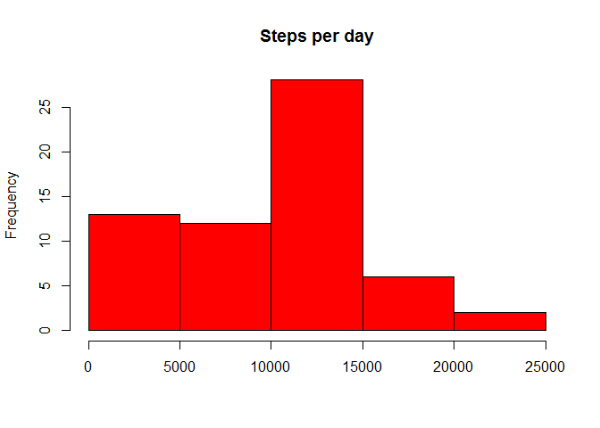
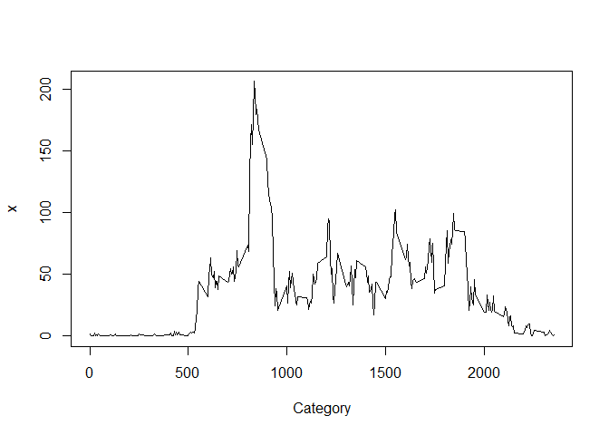
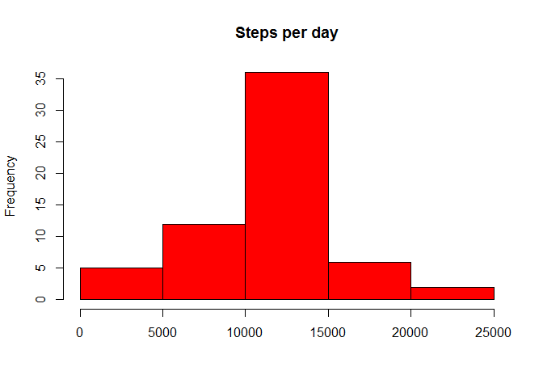

# Reproducible Research: Peer Assessment 1


## Loading and preprocessing the data

```r
setInternet2(use = TRUE)
tmp <- tempfile()
download.file("https://d396qusza40orc.cloudfront.net/repdata%2Fdata%2Factivity.zip",tmp)
data <- read.csv(unz(tmp, "activity.csv"))
# convert the string date  to Date format
data$Date <- as.Date(data$date, "%Y-%m-%d")
unlink(tmp)
```


## What is mean total number of steps taken per day?

```r
dataagg <- aggregate(data$steps, by=list(Category=data$date), FUN=sum,na.rm=TRUE)
hist(dataagg$x, main="Steps per day",col="red",xlab="")
```

 

The mean total number of steps per day is 9354.23 and the median number of steps per day is 10395.00.

## What is the average daily activity pattern?


```r
aggint <- aggregate(data$steps, by=list(Category=data$interval), FUN=mean,na.rm=TRUE)
aggint <- aggregate(steps ~ interval,data = data,FUN=function(x) c(steps =mean(x,na.rm=TRUE) ))
plot(steps ~ interval, aggint, type = "l")
```

 

The 5-minute interval at , on average across all the days in the dataset, contains the maximum number of steps (-\infty{}).

## Imputing missing values


```r
imputed <- data.frame(data)
repfunc <- function(a,b,c) 
  { if(is.na(a)) 
       c$steps[c$interval == b]
    else
      a
  }
for(row in 1:length(imputed$steps)) { 
    imputed$steps[row] <- repfunc(imputed$steps[row], imputed$interval[row],aggint) 
}
imputedagg <- aggregate(imputed$steps, by=list(Category=imputed$date), FUN=sum,na.rm=TRUE)
imputedagg <- aggregate(steps ~ date,data = imputed,FUN=function(x) c(steps =sum(x) ) )

hist(imputedagg$steps, main="Steps per day",col="red",xlab="")
```

 

```r
meandiff <- mean(imputedagg$steps,na.rm=TRUE) - mean(dataagg$x,na.rm=TRUE)
             
if (mean(imputedagg$steps,na.rm=TRUE) > mean(dataagg$x,na.rm=TRUE))
  difftext <- "more" else  difftext <- "less"
```

The number of rows with missing data is 2304.
The mean total number of steps per day is NA and the median number of steps per day is .

There are 1411.959171 more mean daily steps in the imputed  data than in the original data. 

## Are there differences in activity patterns between weekdays and weekends?


```r
repday <- function(a) 
  { c("weekend", "weekday", "weekday", "weekday", "weekday", 
    "weekday", "weekend")[as.POSIXlt(a)$wday + 1]
  }
for(row in 1:length(imputed$steps)) { 
    imputed$day[row] <- repday(imputed$date[row]) 
}
imputed$day <- as.factor(imputed$day) 
#  panel plot containing a time series plot (i.e. type = "l") of the 5-min
library("lattice")
aggday <- aggregate(. ~ interval+day,data = imputed,FUN=function(x) c(steps =mean(x) ) )
xyplot(steps ~ interval | day,
        data = aggday,
        type = "l",
        layout = c(1,2))
```

 
